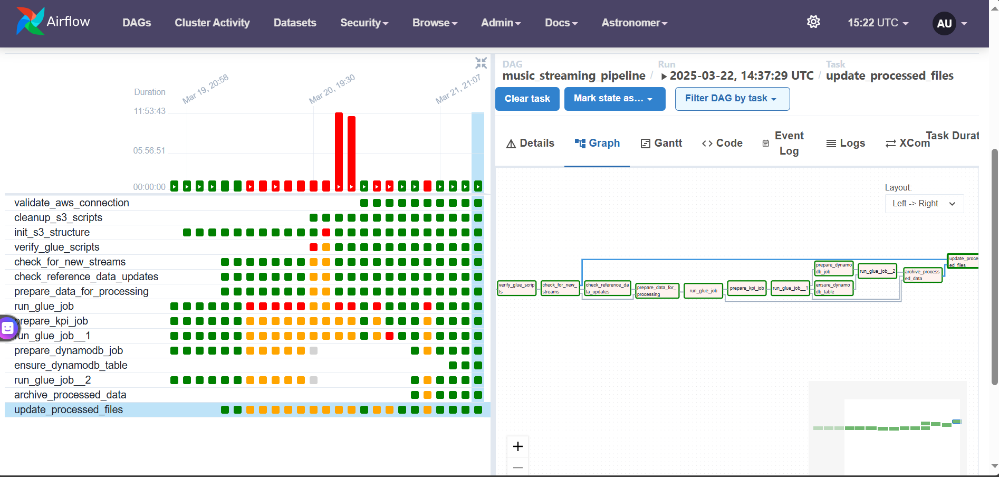

# Music Streaming ETL Pipeline


## Overview

This project implements an automated ETL (Extract, Transform, Load) pipeline for processing music streaming data using Apache Airflow, AWS Glue, and various AWS services. The pipeline processes raw streaming data, validates it, computes KPIs, and stores results in both S3 and DynamoDB.

## Pipeline Architecture

### Airflow DAG Visualization


*Detailed view of the Airflow DAG structure and task dependencies*

### AWS Infrastructure


*Overview of the DAG workflow and component interactions*

## Documentation Index

### Architecture and Design

- [System Architecture](docs/architecture.md)
  - Overall system design
  - Component interaction
  - Data flow diagrams
  - AWS services integration

### Setup and Installation

- [Project Setup Guide](docs/setup.md)
  - Prerequisites
  - Installation steps
  - Configuration
  - Environment setup

### Pipeline Components

- [DAG Documentation](docs/dag.md)
  - DAG structure
  - Task dependencies
  - Task descriptions
  - Flow control

- [AWS Integration](docs/aws-integration.md)
  - S3 configuration
  - Glue jobs
  - DynamoDB setup
  - IAM roles and policies

### Data Processing

- [Data Flow Guide](docs/data-flow.md)
  - Data formats
  - Validation rules
  - Transformation logic
  - KPI computation

### Development Guide

- [Development Guidelines](docs/development.md)
  - Code structure
  - Adding new features
  - Testing procedures
  - Best practices

### Operations

- [Operational Guide](docs/operations.md)
  - Monitoring
  - Troubleshooting
  - Maintenance
  - Backup and recovery

### Security

- [Security Documentation](docs/security.md)
  - Access control
  - Data protection
  - Compliance
  - Best practices

## Infrastructure Components

### AWS Glue Jobs


*AWS Glue jobs configured for ETL processing*

### S3 Storage Structure


*Organization of data and scripts in S3 bucket*

### DynamoDB Storage


*DynamoDB table configuration for KPI storage*

Example of stored data:


## Quick Start

1. Clone the repository

```bash
git clone <repository-url>
```

2. Install dependencies

```bash
pip install -r requirements.txt
```

3. Configure AWS credentials

```bash
aws configure
```

4. Start Airflow

```bash
astro dev start
```

## Project Structure

```markdown
.
├── dags/
│   ├── music_streaming_pipeline.py
│   ├── constants.py
│   └── example_astronauts.py
├── docs/
│   ├── architecture.md
│   ├── setup.md
│   ├── dag.md
│   └── ...
├── include/
├── plugins/
├── tests/
├── .astro/
├── Dockerfile
├── requirements.txt
└── README.md
```

## Contributing

Please read our [Contributing Guidelines](docs/CONTRIBUTING.md) before submitting pull requests.

## License

This project is licensed under the MIT License - see the [LICENSE](LICENSE) file for details.

## Support

For support and questions, please create an issue in the repository or contact the maintainers.
