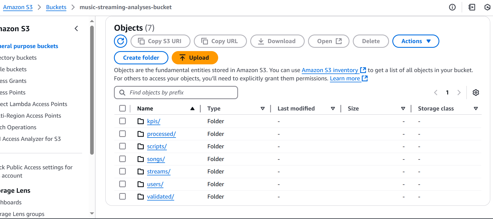

# System Architecture

## Overview


*High-level architecture diagram showing system components and data flow*

The Music Streaming ETL Pipeline is built on a modern, scalable architecture that leverages AWS services and Apache Airflow to process streaming data efficiently. This document outlines the system's architecture, components, and their interactions.

## System Components

### 1. Apache Airflow


*Airflow DAG visualization showing task dependencies and workflow*

- **Role**: Orchestration engine
- **Responsibilities**:
  - DAG scheduling and execution
  - Task dependency management
  - Error handling and retries
  - Resource coordination
- **Version**: Astro Runtime 12.7.1
- **Configuration**: Custom Astronomer deployment

### 2. AWS Services

#### S3 Storage


*Current S3 bucket structure and organization*

- **Purpose**: Data lake storage
- **Directory Structure**:

  ```markdown
  music-streaming-analyses-bucket/
  ├── streams/           # Raw streaming data
  ├── validated/         # Validated data
  ├── processed/         # Processing state files
  ├── archived/          # Archived data
  ├── scripts/           # Glue job scripts
  └── kpis/             # Computed KPIs
  ```

- **Access Patterns**: Read/Write through IAM roles

#### AWS Glue


*Configured Glue jobs for data processing*

- **Purpose**: ETL processing engine
- **Jobs**:
  1. Data Validation
  2. KPI Computation
  3. DynamoDB Loading
- **Configuration**:
  - Worker Type: G.1X
  - Number of Workers: 2
  - Timeout: 60 minutes
  - Concurrent Runs: 3 maximum

#### DynamoDB


*DynamoDB table configuration*


*Example of stored KPI data in DynamoDB*

- **Purpose**: Real-time KPI storage
- **Table Structure**: music_streaming_kpis
- **Access Pattern**: Write-heavy with occasional reads
- **Capacity**: On-demand scaling

## Data Flow


## Component Interaction

### 1. Data Ingestion

1. Raw streaming data arrives in the `streams/` directory
2. Airflow DAG detects new files
3. Reference data updates are checked
4. Files are prepared for processing

### 2. Data Validation

1. Glue validation job processes raw data
2. Validates data structure and content
3. Writes validated data to `validated/` directory
4. Updates processing state

### 3. KPI Computation

1. Glue KPI job processes validated data
2. Computes required metrics
3. Writes results to `kpis/` directory

### 4. Data Loading

1. Glue DynamoDB job loads KPIs
2. Updates DynamoDB tables
3. Handles error cases and retries

### 5. Archival

1. Processed files are moved to dated archives
2. Original files are removed after successful archival
3. Archive structure maintains data lineage

## Security Architecture

### IAM Roles and Policies

- **Glue Service Role**: `AWSGlueServiceRole-MusicStreaming`
  - S3 access for data processing
  - DynamoDB access for data loading
  - CloudWatch access for logging

### Data Protection

- **In Transit**: SSL/TLS encryption
- **At Rest**: S3 server-side encryption
- **Access Control**: IAM policies and bucket policies

## Monitoring and Logging

### CloudWatch Integration

- Glue job metrics and logs
- S3 access logs
- DynamoDB operation logs

### Airflow Monitoring

- Task success/failure metrics
- Processing duration tracking
- Error logging and alerting

## Scalability and Performance

### Design Considerations

- Parallel processing capability
- Configurable worker counts
- Resource optimization
- Error handling and recovery

### Performance Optimizations

- S3 prefix organization for efficient listing
- DynamoDB capacity management
- Glue job parameter tuning
- Archive strategy for historical data

## System Requirements

### Minimum Requirements

- AWS Account with appropriate permissions
- Python 3.13 or higher
- Apache Airflow 2.x
- Astronomer CLI

### Recommended Specifications

- S3 bucket with versioning enabled
- DynamoDB with on-demand capacity
- Glue workers with sufficient memory
- Network access to AWS services

## Future Considerations

### Potential Enhancements

- Real-time processing capabilities
- Enhanced monitoring and alerting
- Additional data quality checks
- Performance optimization features

### Scalability Plans

- Multi-region support
- Increased concurrent processing
- Enhanced error handling
- Additional KPI computations
