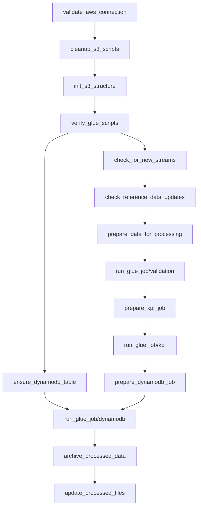

# DAG Documentation

## Overview

*Complete DAG structure with all tasks and dependencies*

The `music_streaming_pipeline` DAG orchestrates the ETL process for music streaming data. It handles data validation, KPI computation, and storage in DynamoDB using AWS Glue jobs.

## DAG Visualization

*Detailed view of DAG tasks and their execution flow*

## DAG Configuration

### Basic Settings

- **DAG ID**: `music_streaming_pipeline`
- **Description**: Process music streaming data and compute daily KPIs
- **Schedule**: Daily
- **Tags**: music, streaming, etl
- **Owner**: airflow
- **Start Date**: Current date
- **Retries**: Configurable per task
- **Retry Delay**: Configurable per task

### Dependencies

## Tasks

### 1. Initialization Tasks

#### `validate_aws_connection`

- **Purpose**: Validates AWS credentials and connectivity
- **Type**: Python function
- **Retries**: 3
- **Timeout**: 5 minutes

#### `cleanup_s3_scripts`

- **Purpose**: Removes old Glue scripts from S3
- **Type**: Python function
- **Dependencies**: Requires valid AWS connection

#### `init_s3_structure`

- **Purpose**: Creates required S3 directories and uploads Glue scripts
- **Type**: Python function
- **Key Operations**:
  - Creates directory structure
  - Uploads Glue scripts
  - Initializes state files

#### `verify_glue_scripts`

- **Purpose**: Verifies Glue scripts existence and permissions
- **Type**: Python function
- **Failure Handling**: Raises AirflowException if scripts are missing

### 2. Data Processing Tasks

#### `check_for_new_streams`

- **Purpose**: Identifies new streaming data files
- **Type**: Python function
- **Output**: List of new files to process
- **XCom Usage**: Pushes file list for downstream tasks

#### `check_reference_data_updates`

- **Purpose**: Checks for reference data changes
- **Type**: Python function
- **Output**: Reference data state
- **XCom Usage**: Pushes update status

#### `prepare_data_for_processing`

- **Purpose**: Prepares job parameters for validation
- **Type**: Python function
- **Input**: New streams and reference updates
- **Output**: Glue job parameters

### 3. Glue Job Tasks

#### `run_glue_job`

- **Purpose**: Generic task for running Glue jobs
- **Type**: GlueJobOperator
- **Configuration**:
  - Worker Type: G.1X
  - Number of Workers: 2
  - Timeout: 60 minutes
  - Max Concurrent Runs: 3
- **Used For**:
  1. Data validation
  2. KPI computation
  3. DynamoDB loading

### 4. Data Storage Tasks

#### `ensure_dynamodb_table`

- **Purpose**: Creates/verifies DynamoDB table
- **Type**: Python function
- **Table Properties**:
  - Table Name: music_streaming_kpis
  - Key Schema: id (HASH)
  - Billing Mode: PAY_PER_REQUEST

### 5. Cleanup Tasks

#### `archive_processed_data`

- **Purpose**: Archives processed files
- **Type**: Python function
- **Operations**:
  - Moves validated data to archive
  - Moves KPI results to archive
  - Maintains directory structure

#### `update_processed_files`

- **Purpose**: Updates processing state
- **Type**: Python function
- **State Management**: Updates processed_streams.json

## Error Handling

### Retry Configuration

- Default retries: 3
- Retry delay: 5 minutes
- Email on failure: Configurable

### Failure Scenarios

1. **AWS Connection Failures**
   - Retry with exponential backoff
   - Alert on persistent failures

2. **Glue Job Failures**
   - Automatic retry
   - Detailed error logging
   - State preservation

3. **Data Validation Errors**
   - Error reporting
   - Data quarantine
   - Alert generation

## Monitoring

### Airflow Metrics

- Task duration
- Success/failure rates
- Retry counts
- XCom usage

### AWS CloudWatch Metrics

- Glue job metrics
- S3 operations
- DynamoDB throughput

### Logging

- Task-level logging
- Glue job logs
- Error tracking
- Performance metrics

## Best Practices

### DAG Development

1. Use task groups for organization
2. Implement proper error handling
3. Maintain idempotency
4. Document XCom usage

### Performance

1. Optimize task dependencies
2. Configure appropriate timeouts
3. Monitor resource usage
4. Implement efficient retries

### Maintenance

1. Regular code reviews
2. Performance monitoring
3. Error pattern analysis
4. Documentation updates

## Testing

### Unit Tests

- Task function testing
- Parameter validation
- Error handling verification

### Integration Tests

- End-to-end DAG runs
- AWS service integration
- Data flow validation

## Security

### Access Control

- IAM role configuration
- S3 bucket policies
- DynamoDB access

### Data Protection

- Encryption in transit
- Encryption at rest
- Access logging
