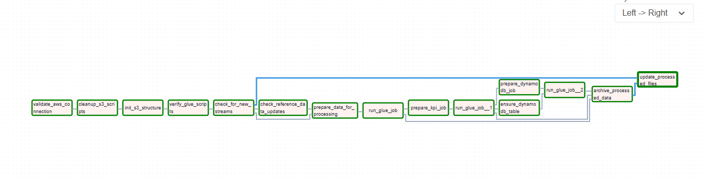
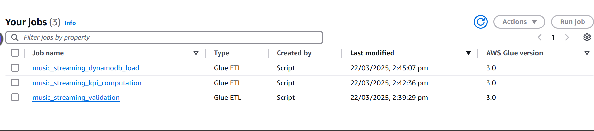
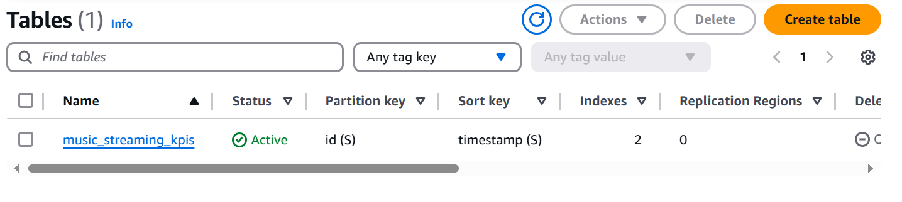

# Data Flow Guide

## Pipeline Overview


*End-to-end data flow architecture*

## Processing Stages


*DAG workflow showing data processing stages*

### 1. Data Ingestion


*S3 bucket organization for data processing*

- **Location**: `s3://music-streaming-analyses-bucket/streams/`
- **Format**: JSON files
- **Frequency**: Near real-time
- **Validation**:
  - Schema validation
  - Data type checking
  - Required field verification

### 2. Data Processing


*AWS Glue jobs for data processing*

### 3. Data Storage


*DynamoDB table structure*

#### Example Data


*Sample processed data in DynamoDB*

## Data Structure

### Raw Streaming Data

```json
{
    "stream_id": "string",
    "user_id": "string",
    "song_id": "string",
    "timestamp": "ISO8601 timestamp",
    "duration": "integer (seconds)",
    "completed": "boolean",
    "device_type": "string"
}
```

### Reference Data

#### Songs Table

```json
{
    "song_id": "string",
    "title": "string",
    "artist": "string",
    "genre": "string",
    "duration": "integer",
    "release_date": "date"
}
```

#### Users Table

```json
{
    "user_id": "string",
    "subscription_type": "string",
    "country": "string",
    "join_date": "date"
}
```

## Data Flow Stages

### 1. Data Ingestion

- **Location**: `s3://music-streaming-analyses-bucket/streams/`
- **Format**: JSON files
- **Frequency**: Near real-time
- **Validation**:
  - Schema validation
  - Data type checking
  - Required field verification

### 2. Data Validation (Glue Job 1)

- **Input**: Raw streaming data
- **Process**:

  ```python
  # Pseudo-code representation
  def validate_data():
      # Schema validation
      validate_schema(streaming_data)
      
      # Data quality checks
      check_timestamps()
      verify_references()
      
      # Enrichment
      add_metadata()
      normalize_fields()
  ```

- **Output**: Validated Parquet files
- **Location**: `s3://music-streaming-analyses-bucket/validated/`

### 3. KPI Computation (Glue Job 2)

- **Input**: Validated streaming data
- **Reference Data**: Songs and Users tables
- **Computed Metrics**:
  1. User Engagement
     - Daily active users
     - Average session duration
     - Completion rates
  2. Content Performance
     - Top songs
     - Genre distribution
     - Artist popularity
  3. Platform Usage
     - Device type distribution
     - Peak usage times
     - Geographic distribution

### 4. DynamoDB Loading (Glue Job 3)

- **Input**: Computed KPIs
- **Table Structure**:

```json
{
    "id": "string (HASH)",
    "metric_type": "string",
    "timestamp": "string",
    "value": "number",
    "dimensions": "map",
    "metadata": "map"
}
```

- **Access Patterns**:
  - Get KPIs by time range
  - Query by metric type
  - Filter by dimensions

## Data Transformations

### 1. Validation Transformations

```python
# Pseudo-code of key transformations
def transform_raw_data(df):
    # Standardize timestamps
    df = standardize_timestamps(df)
    
    # Validate foreign keys
    df = validate_references(df)
    
    # Add metadata
    df = enrich_with_metadata(df)
    
    return df
```

### 2. KPI Transformations

```python
# Pseudo-code of KPI computation
def compute_kpis(df):
    # User metrics
    user_metrics = compute_user_metrics(df)
    
    # Content metrics
    content_metrics = compute_content_metrics(df)
    
    # Platform metrics
    platform_metrics = compute_platform_metrics(df)
    
    return combine_metrics(
        user_metrics,
        content_metrics,
        platform_metrics
    )
```

## Data Quality

### Validation Rules

1. **Schema Validation**
   - Required fields present
   - Correct data types
   - Valid value ranges

2. **Business Rules**
   - Valid user IDs
   - Valid song IDs
   - Logical timestamps
   - Duration constraints

3. **Reference Integrity**
   - User existence
   - Song existence
   - Valid relationships

### Quality Metrics

- **Completeness**: % of required fields
- **Accuracy**: % of valid values
- **Consistency**: % of matching references
- **Timeliness**: Data freshness

## Data Retention

### Storage Duration

1. **Raw Data**: 30 days
2. **Validated Data**: 90 days
3. **Computed KPIs**: 365 days
4. **Archived Data**: 7 years

### Archival Process

1. Daily archival of processed data
2. Compression of archived files
3. Lifecycle policies for cost optimization
4. Audit trail maintenance

## Performance Considerations

### Optimization Techniques

1. **Partitioning**
   - By date
   - By region
   - By metric type

2. **File Format**
   - Raw: JSON
   - Processed: Parquet
   - Optimized: Snappy compression

3. **Query Optimization**
   - Partition pruning
   - Predicate pushdown
   - Column projection

### Monitoring Metrics

1. **Processing Time**
   - Validation job duration
   - KPI computation time
   - Loading latency

2. **Resource Usage**
   - Memory utilization
   - CPU usage
   - I/O operations

3. **Data Volume**
   - Input size
   - Output size
   - Compression ratio

## Error Handling

### Data Errors

1. **Invalid Records**
   - Quarantine in separate S3 prefix
   - Error logging
   - Retry mechanism

2. **Missing References**
   - Default value assignment
   - Error reporting
   - Manual review queue

### System Errors

1. **Job Failures**
   - Automatic retry
   - Alert notification
   - State recovery

2. **Resource Issues**
   - Dynamic scaling
   - Resource monitoring
   - Alert thresholds

## Security and Compliance

### Data Protection

1. **Encryption**
   - In-transit: TLS
   - At-rest: S3 encryption
   - DynamoDB encryption

2. **Access Control**
   - IAM roles
   - Bucket policies
   - KMS keys

### Audit Trail

1. **Logging**
   - CloudTrail
   - S3 access logs
   - DynamoDB streams

2. **Monitoring**
   - CloudWatch metrics
   - Custom dashboards
   - Alert configuration
