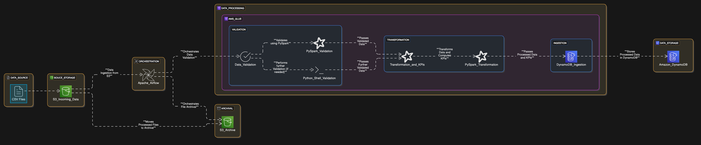

# Setup Guide

## Infrastructure Overview


*System architecture and component relationships*

## Prerequisites

### Required Software

- Python 3.13 or higher
- Docker Desktop
- AWS CLI
- Astronomer CLI
- Git

### AWS Account Requirements

- AWS account with administrative access
- AWS credentials configured locally
- The following services enabled:
  - S3
  - AWS Glue
  - DynamoDB
  - CloudWatch
  - IAM

## Installation Steps

### 1. Clone the Repository

```bash
git clone <repository-url>
cd music-streaming-pipeline
```

### 2. Environment Setup

#### Create Python Virtual Environment

```bash
python -m venv .venv
source .venv/bin/activate  # On Windows: .venv\Scripts\activate
pip install --upgrade pip
```

#### Install Dependencies

```bash
pip install -r requirements.txt
```

### 3. AWS Configuration

#### AWS Resources Setup


*Required S3 bucket structure*

#### Configure AWS CLI

```bash
aws configure
```

Enter your:

- AWS Access Key ID
- AWS Secret Access Key
- Default region (e.g., eu-west-1)
- Default output format (json)

#### Create Required AWS Resources

1. **Create S3 Bucket**

```bash
aws s3 mb s3://music-streaming-analyses-bucket
```

2. **Enable Versioning**

```bash
aws s3api put-bucket-versioning \
    --bucket music-streaming-analyses-bucket \
    --versioning-configuration Status=Enabled
```

3. **Create Required S3 Directories**

```bash
for dir in streams validated processed archived scripts kpis; do
    aws s3api put-object --bucket music-streaming-analyses-bucket --key ${dir}/
done
```

### 4. AWS Glue Setup

#### Glue Jobs Configuration


*Required Glue jobs setup*

#### Create IAM Role

1. Navigate to IAM Console
2. Create role `AWSGlueServiceRole-MusicStreaming`
3. Attach policies:
   - AWSGlueServiceRole
   - AWSGlueServiceNotebookRole
   - Custom S3 access policy
   - Custom DynamoDB access policy

#### Create Glue Jobs

1. Upload Glue scripts to S3:

```bash
aws s3 cp scripts/validate_data.py s3://music-streaming-analyses-bucket/scripts/
aws s3 cp scripts/compute_kpis.py s3://music-streaming-analyses-bucket/scripts/
aws s3 cp scripts/load_dynamodb.py s3://music-streaming-analyses-bucket/scripts/
```

2. Create Glue jobs using AWS Console or AWS CLI:

```bash
aws glue create-job \
    --name music_streaming_validation \
    --role AWSGlueServiceRole-MusicStreaming \
    --command "Name=glueetl,ScriptLocation=s3://music-streaming-analyses-bucket/scripts/validate_data.py" \
    --default-arguments '{"--TempDir": "s3://music-streaming-analyses-bucket/temporary/"}' \
    --glue-version "3.0" \
    --worker-type "G.1X" \
    --number-of-workers 2
```

### 5. DynamoDB Setup

#### DynamoDB Setup


*DynamoDB table structure*

#### Create DynamoDB Table

```bash
aws dynamodb create-table \
    --table-name music_streaming_kpis \
    --attribute-definitions AttributeName=id,AttributeType=S \
    --key-schema AttributeName=id,KeyType=HASH \
    --billing-mode PAY_PER_REQUEST
```

### 6. Airflow Configuration

#### Initialize Astro Project

```bash
astro dev init
```

#### Configure Airflow Connections

1. Start Airflow:

```bash
astro dev start
```

2. Access Airflow UI at `http://localhost:8080`

3. Add AWS Connection:
   - Conn Id: aws_conn
   - Conn Type: Amazon Web Services
   - Login: Your AWS Access Key ID
   - Password: Your AWS Secret Access Key
   - Extra: {"region_name": "eu-west-1"}

### 7. Environment Variables

Create `.env` file:

```bash
AWS_REGION=eu-west-1
S3_BUCKET=music-streaming-analyses-bucket
AIRFLOW_VAR_AWS_CONN_ID=aws_conn
```

## Verification Steps

### 1. Check AWS Resources

```bash
# Check S3 bucket structure
aws s3 ls s3://music-streaming-analyses-bucket/

# Verify Glue jobs
aws glue get-jobs

# Check DynamoDB table
aws dynamodb describe-table --table-name music_streaming_kpis
```

### 2. Test Airflow DAG

1. Access Airflow UI
2. Locate `music_streaming_pipeline` DAG
3. Toggle DAG to "On"
4. Trigger DAG manually
5. Monitor execution in Airflow UI

### 3. Monitor Logs

- Check CloudWatch logs for Glue jobs
- Review Airflow task logs
- Monitor S3 access logs

## Troubleshooting

### Common Issues

1. **AWS Permissions**
   - Verify IAM role permissions
   - Check AWS credentials configuration
   - Ensure S3 bucket policies are correct

2. **Airflow Connection**
   - Verify AWS connection details
   - Check region configuration
   - Ensure proper IAM permissions

3. **Glue Jobs**
   - Check script locations in S3
   - Verify worker configuration
   - Monitor CloudWatch logs for errors

4. **DynamoDB**
   - Verify table creation
   - Check capacity settings
   - Monitor throughput metrics

## Next Steps

After successful setup:

1. Review [Data Flow Guide](data-flow.md)
2. Configure monitoring alerts
3. Set up backup procedures
4. Review security settings

## Support

For additional support:

1. Check project documentation
2. Review AWS documentation
3. Create GitHub issue
4. Contact project maintainers
